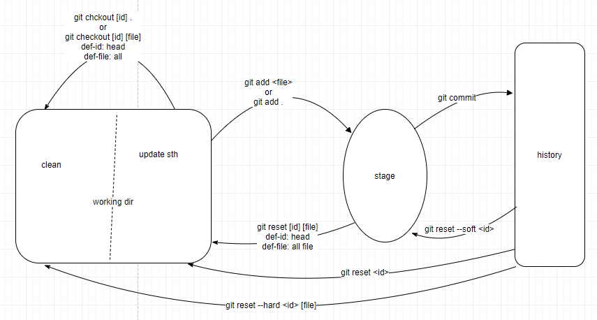

# git step by step

- Working directory
- Index/Stage
- History

[check here](https://www.draw.io/?lightbox=1&highlight=0000ff&edit=_blank&layers=1&nav=1&title=Untitled%20Diagram.xml#R5ZpLc6M4EIB%2FjY9OIcTzOElmdi9bNVWZqp09KiAbVbDlEnLszK9fCQTWA2LHgTjjySWo9UB0tz61Wp7Bu9X%2BL4Y2xT80x%2BXM9%2FL9DN7PfPEXQvFPSl4aSRwFjWDJSN6IwEHwQH5hJfSUdEtyXBkNOaUlJxtTmNH1GmfckCHG6M5stqCl%2BdYNWmJH8JCh0pX%2BS3JeNNLEjw%2FyvzFZFu2bQZQ2NSvUNlZfUhUopztNBL%2FO4B2jlDdPq%2F0dLqXyWr00%2Fb4N1HYTY3jNT%2BngNx2eUblV36bmxV%2Faj2V0u86xbA9m8HZXEI4fNiiTtTthXiEr%2BKpU1Sv6jB7rnrLEcEV%2B6WXKEdfKwi%2BwXsY50YvKfJpEzRYzjveDXww6PQoHxHSFOXsRTVSHOYjDpo9yPj9QttgdTOknSlZoZuyMhpT7LLvBDxoWD0rJ%2FQoPHIUXpOJUDXK23kdQTNjqQekFBKGjF%2BD16AWOoZfQ0UvF5Sq0tSJ6iVWOP0QjfgpvjvsK8Ht0AtIRdBIdX5x4nX%2BRQBOlx5JmT6YORO03UralbMueO3%2FCe8J%2Fas%2F%2FiWfvxvciVf6OGRETxkzK66HE5H%2FWjUBbbPqAOG0Fdqdmujh3aGpZQHwS3bIMG0ziiC0x17zDtZNmhbDHCK2M4RJx8mxOos8w6g3fKRHT69wAxNbCiC3bNpNXvXTYWgPB8MhAzSc7AwkLoxet2UY2qIYn3O2T1nsObteMeHDCTqcn%2BWXs%2BOWSyNejPJ%2FJxRChlVyMpTDD7YIIV20lS147RVTXPDLxVEsoc2X6iDeO24s1zU1X17ca6XpKR6J1eDsL74UElWS5FoJM%2BJ700FvJBiI29S%2BqYkXyXPa%2FLdEjLm9R9rSsGXxHS8rq98JF%2FfcaXcw967DR6z4fvb5BiWWYeL5hwTmA73PltgldLCrMLW94q%2F2Tj%2BaSzh%2BhHg%2BaBJJ8GJVAoUug4JIECjxobUPReQSy93ghmIRAQWxNGIxLoHSAQBldrQi%2FMlwkH4%2BLvQH6dlR7gFFg0u5VJ9JkTdd4CCbeEExEkBIkRqDjeeHxQCcBJmiGICMiVcbbCWYlqiqS%2FSjIuq3SWDdaRORfkkfCv6zAGERnEgn4zlATRUVzaLIvGRdJAAwxqcie6FY%2BCbaI1oIudUhzehSUFbhnCPFYB1eyYPfL8WIuJ%2Faltj%2FK%2B1vU3es2SH6K3eTKMAq8We%2BS%2BW3CrnYyZ5MyR1XRsfFUEl2MMVaoEoTheYSx170fWAMN8OUMC%2FVkMXaUPZH1Ughzwq5tRcFjKwqkqQn3OfhMC8o113aTI45rIxXjWGvLadUksIFmvBIveI%2FpOJXH5GqDMuEzP2Thfh68M5nVun3qpvPinuU7RjIPuJmrrMRofSUa7aIgC1GwjWU1FQdTqdhNwrxtMzghbAYiTA6MsDmJ2vJw2KyHzOBC0fFl84VRYu5c8MzYGIahNdBpO9eb84W%2BtdUGI4fGbsKoCWzFYsdTR7WeykBeeXAbH9uKJ0sSQN86wM395MZy1HG2azfrMzry5KE%2FNpCXQt%2FMCtjZxxh2FyIOFHtAOTkOP1%2Fy0tol05GSl93AYycvo2lx6LsZLxOH83lFFzUXjasUktsXKdeFsPRiCAMOwmA6CcJ8N0k0BcKaG1mFMNAmOzWEWVe4qe9%2FKoT1RHQXRRhMLSJEFnnORlgcT4Iw30JYOPL9S2uh4YjuTyLXsXPihORKEptcdnZrHG69N%2FX4Grc0Lvkz6%2FD43vsW%2FQYoMqEIho6y18GsufWrlcDOOpzMrBBYzJrmFAoSi1kjX9D0%2FPTODrsKxPIT4GUcUq%2BLZEczur8ZyUTx8GPapvnhJ8nw6%2F8%3D)



```sh
# init
git init
# 在整个过程中我会不断编辑 readme， 为了不影响实验结果， 需要暂时排除它
#  create readme & resources dir & .gitignore
➜  git-step-by-step git:(master) touch readme.md
➜  git-step-by-step git:(master) ✗ mkdir resources
➜  git-step-by-step git:(master) ✗ touch .gitignore
➜  git-step-by-step git:(master) ✗ ls
readme.md  resources .gitignore
➜  git-step-by-step git:(master) ✗ echo resources > .gitignore
➜  git-step-by-step git:(master) ✗ echo readme.md >> .gitignore
➜  git-step-by-step git:(master) ✗ cat .gitignore
resources
readme.md
# add all files to Index area
➜  git-step-by-step git:(master) ✗ git add .
# commit
➜  git-step-by-step git:(master) ✗ git commit -m "init"
[master 9742542] init
 1 file changed, 2 insertions(+)
 create mode 100644 .gitignore

#####################################################

# now, let's create a file naming "file1"
➜  git-step-by-step git:(master) touch file1
➜  git-step-by-step git:(master) ✗ git add .
➜  git-step-by-step git:(master) ✗ git commit -m "create file1"

# add a line of code to file1
➜  git-step-by-step git:(master) echo hello world > file1
➜  git-step-by-step git:(master) ✗ git add file1
➜  git-step-by-step git:(master) ✗ git commit -m "add one line of code to file1"

# update file1 but without adding
➜  git-step-by-step git:(master) echo add sth... >> file1
➜  git-step-by-step git:(master) ✗ git status
On branch master
Changes not staged for commit:
  (use "git add <file>..." to update what will be committed)
  (use "git checkout -- <file>..." to discard changes in working directory)

        modified:   file1

no changes added to commit (use "git add" and/or "git commit -a")

############ 还没有 add 到 Index, 希望丢弃 Working dir 的修改

# 📌 git checkout -- <file>
➜  git-step-by-step git:(master) ✗ git checkout -- file1
➜  git-step-by-step git:(master) git status
On branch master
nothing to commit, working tree clean

############# 修改 file1, add 到 Index, 不 commit, 希望丢弃修改

# 准备工作
➜  git-step-by-step git:(master) ✗ echo update sth >> file1
➜  git-step-by-step git:(master) ✗ git add .
➜  git-step-by-step git:(master) ✗ git status
On branch master
Changes to be committed:
  (use "git reset HEAD <file>..." to unstage)

        modified:   file1

# 首先将改动取消 Index
# 📌 git reset [id] [file] 取消 Index (修改还未丢弃), id 默认是 head, file 默认是全部文件
➜  git-step-by-step git:(master) ✗ git reset
Unstaged changes after reset:
M       file1
➜  git-step-by-step git:(master) ✗ git status
On branch master
Changes not staged for commit:
  (use "git add <file>..." to update what will be committed)
  (use "git checkout -- <file>..." to discard changes in working directory)

        modified:   file1

no changes added to commit (use "git add" and/or "git commit -a")
# 然后 丢弃修改
# 📌 git checkout [id] <file>, git checkout [id] ., id 默认 head, 修改完全被丢弃, working dir 和 History 完全一致了
➜  git-step-by-step git:(master) ✗ git checkout file1


############ 再次修改 file1, 并 add 到 Index, commit 到 History, 此时如果希望恢复到上一步, 分2种情况:

# 准备工作
➜  git-step-by-step git:(master) echo update sth >> file1
➜  git-step-by-step git:(master) ✗ git add file1
➜  git-step-by-step git:(master) ✗ git commit -m "update file1"

#### case1. 仅仅在 History 中恢复到上一步, 不丢弃改动 -- eg: 如果 commit 的 message 有误, 希望重新写
# 首先找到上一步的 commit id 825b9e2
➜  git-step-by-step git:(master) git log --oneline
560fc87 (HEAD -> master) update file1
825b9e2 add one line of code to file1
b4696e4 create file1
9742542 init
# History 回退到上一步, 不丢弃改动, 此时改动是待 commit 状态
# 📌 git reset --soft <id>
➜  git-step-by-step git:(master) git reset --soft 825b9e2
➜  git-step-by-step git:(master) ✗ git status
On branch master
Changes to be committed:
  (use "git reset HEAD <file>..." to unstage)

        modified:   file1

#### case2. 直接丢弃修改, Working dir也恢复到上一次 -- eg: 如果一次 commit 了太多代码, 希望分多次 commit, 记录更细粒度的 commit 信息
# 同样先找 last commit id
# History 回退到上一步, 不丢弃改动, 只是取消 Index , 此时改动是待 add 状态
# 📌 git reset [id] [file] , id 默认是 head, file 默认是全部文件
➜  git-step-by-step git:(master) ✗ git reset 825b9e2
Unstaged changes after reset:
M       file1
➜  git-step-by-step git:(master) ✗ git status
On branch master
Changes not staged for commit:
  (use "git add <file>..." to update what will be committed)
  (use "git checkout -- <file>..." to discard changes in working directory)

        modified:   file1

no changes added to commit (use "git add" and/or "git commit -a")
# 修改完全丢弃
# 📌 git checkout [id] <file>, git checkout [id] . , working dir 和 History 完全一致了
➜  git-step-by-step git:(master) ✗ git checkout .
➜  git-step-by-step git:(master) git status
On branch master
nothing to commit, working tree clean

# 针对 case2, 有一个快捷方式: git reset --hard [id] [file] 回退上个commit 一步到位, 改动直接被丢弃, working dir 和 History 保持一致

############ git revert 和 git reset 很像, 但有区别
# git revert <id> 会在 "current" 的未来 生成新的 commit, 删除 id 到 "current" 这段区间内的改动, 并且这段区间内的 commit 不会丢失
# git reset id 会丢失掉 区间内的 commit


############ 接下来看看 deteched HEAD (head分离状态)

# detected head 下, 可以随意修改, 然后 commit, 最后离开 detected head 状态时, 这些修改都不会生效 (相当于这些修改位于 "匿名分支" 上, 一旦离开 "匿名分支", 就无法回来了)
# 如果希望生效, 可以 checkout -b 到一条新分支来保存这些修改

# 准备工作
➜  git-step-by-step git:(master) echo \\rupdate sth >> file1
➜  git-step-by-step git:(master) git commit -a -m "update file1 one"
➜  git-step-by-step git:(master) echo \\rupdate sth 2 >> file1
➜  git-step-by-step git:(master) ✗ git commit -a -m "update sth two"

# 查看 log 找到 d86e382
➜  git-step-by-step git:(master) git log --oneline
1b4aa36 (HEAD -> master) update sth two
d86e382 update file1 one
825b9e2 add one line of code to file1
b4696e4 create file1
9742542 init
# 从 History 中 checkout 出 d86e382 对应的代码, 此时处于 detected head 状态
➜  git-step-by-step git:(master) git checkout d86e382
Note: checking out 'd86e382'.

You are in 'detached HEAD' state. You can look around, make experimental
changes and commit them, and you can discard any commits you make in this
state without impacting any branches by performing another checkout.

If you want to create a new branch to retain commits you create, you may
do so (now or later) by using -b with the checkout command again. Example:

  git checkout -b <new-branch-name>

HEAD is now at d86e382 update file1 one
# 看看 log 是什么样的
➜  git-step-by-step git:(d86e382) git log --oneline
d86e382 (HEAD) update file1 one # master 对应的节点在 head 前边, 这里看不到了
825b9e2 add one line of code to file1
b4696e4 create file1
9742542 init
# 看看 status
➜  git-step-by-step git:(d86e382) git status
HEAD detached at d86e382
nothing to commit, working tree clean
# 此时 修改, 提交 都可以正常进行, 这里就省略了
# 做出修改, 提交, 离开 detected head 状态
➜  git-step-by-step git:(66e1cd8) git checkout master
Warning: you are leaving 1 commit behind, not connected to # 提示有一个 commit 正被丢弃
any of your branches:

  66e1cd8 update on branch without a name # 这是找到这个 commit id 的唯一机会, 一旦错过后面就不容易找到了

If you want to keep it by creating a new branch, this may be a good time
to do so with:

 git branch <new-branch-name> 66e1cd8

Switched to branch 'master'
# 现在, 希望将这个 commit (A) 合并到 master 上, 按照提示:
➜  git-step-by-step git:(master) git branch branch_1 66e1cd8
➜  git-step-by-step git:(master) git checkout branch_1
# 📌 rebase合并: 分岔节点到 commit A 节点 整个移动到 master 分支最前面, 后一个实验会说到
# 这里我在 commit A 上做的修改造成了 conflict
➜  git-step-by-step git:(branch_1) git rebase master # 这里我是将其他分支 rebase 到 master, 其实最好是将 master rebase 到其他分支, 这样就能保证 master 再最前面
First, rewinding head to replay your work on top of it...
Applying: update on branch without a name
Using index info to reconstruct a base tree...
M       file1
Falling back to patching base and 3-way merge...
Auto-merging file1
CONFLICT (content): Merge conflict in file1
error: Failed to merge in the changes.
Patch failed at 0001 update on branch without a name
Use 'git am --show-current-patch' to see the failed patch

Resolve all conflicts manually, mark them as resolved with
"git add/rm <conflicted_files>", then run "git rebase --continue".
You can instead skip this commit: run "git rebase --skip".
To abort and get back to the state before "git rebase", run "git rebase --abort".
# 看看 conflict 下的 status
➜  git-step-by-step git:(1b4aa36) ✗ git status
rebase in progress; onto 1b4aa36
You are currently rebasing branch 'branch_1' on '1b4aa36'. # 1b4aa36 是 master 的 id
  (fix conflicts and then run "git rebase --continue")
  (use "git rebase --skip" to skip this patch)
  (use "git rebase --abort" to check out the original branch)

Unmerged paths:
  (use "git reset HEAD <file>..." to unstage)
  (use "git add <file>..." to mark resolution)

        both modified:   file1

no changes added to commit (use "git add" and/or "git commit -a")
# 解决完之后, 需要 add, 再继续 rebase
➜  git-step-by-step git:(1b4aa36) ✗ git add file1
➜  git-step-by-step git:(1b4aa36) ✗ git rebase --continue
Applying: update on branch without a name
# 至此, rebase 成功, 看看 log
➜  git-step-by-step git:(branch_1) git log --oneline
b6b2c88 (HEAD -> branch_1) update on branch without a name
1b4aa36 (master) update sth two
d86e382 update file1 one
825b9e2 add one line of code to file1
b4696e4 create file1
9742542 init

############ git rebase branch 移动当前分支到指定分支的头部
# 和 git merge 区别: git merge 不是 "移动分支", 而是生成一个新的 commit, 这样从分岔点到合并点会造成一个闭环, 给人理解造成困惑; rebase 避免了这以点
# git rebase -i <branch> 交互式地进行rebase, 一般是在push到 remote 之前进行一次统一大清理
# git rebase -i <commit> 其中 -i 是选择不动的 commit, 比他新的 commit 都有被合并or修改的可能,
# todo

########### git stash 暂存 working dir 中不想 commit 的修改, 无论是否 add 到 Index, 统统 stash
# git stash save "xxx" 带 message 的 stash
# git stash apply [name] 取出, 但并不删除stash, 默认使用最近的stash (stash@{0})
# git stash drop [name] 直接移除 stash
# git stash clear       清除所有
# git stash pop 将缓存堆栈中的第一个stash删除，并将对应修改应用到当前的工作目录下。
# git stash list 查看现有stash
# 典型输出
stash@{0}: WIP on master: 049d078 added the index file
stash@{1}: WIP on master: c264051 Revert "added file_size"
stash@{2}: WIP on master: 21d80a5 added number to log
# git stash branch 取出 stash 到新的 branch

# 考虑这样一种场景: 对文件做出了一些修改, 没有 add 到 Index (或者 add 到了 Index 还没有 commit), 此时从 History 中 checkout

# 两种情况 checkout 操作均失败, 有如下提示
error: Your local changes to the following files would be overwritten by checkout: # working dir 中的改动会被覆盖
        file1
Please commit your changes or stash them before you switch branches.
Aborting
# 此时用 git stash 可以很好的解决


########## git rm 和 git rm --cached 区别
# git rm            删除 working dir 中的文件， 并且将改动 add 到 Index。
# git rm --cached   删除 History 中的文件（但是保留 working dir 中的文件）， 并将改动 add 到 Index

```